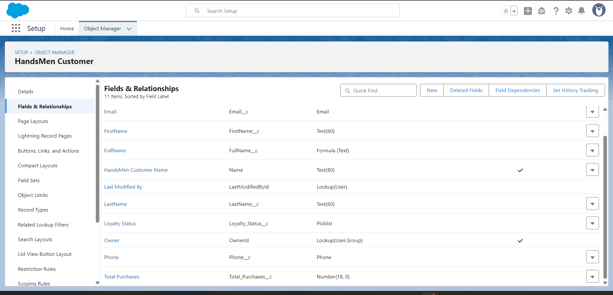
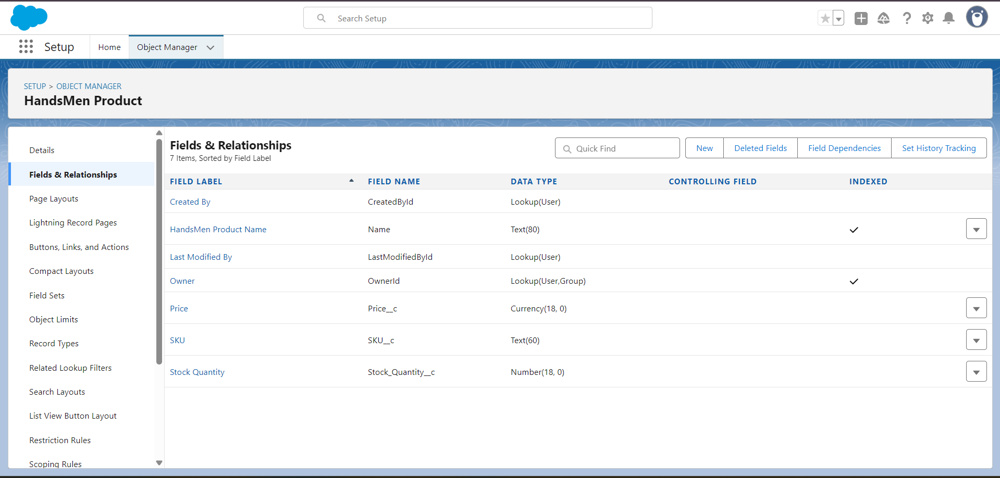
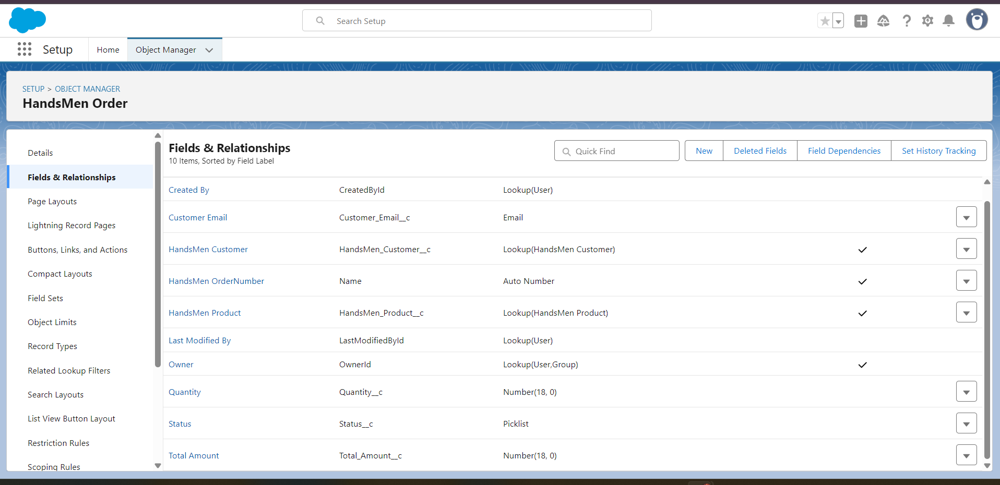
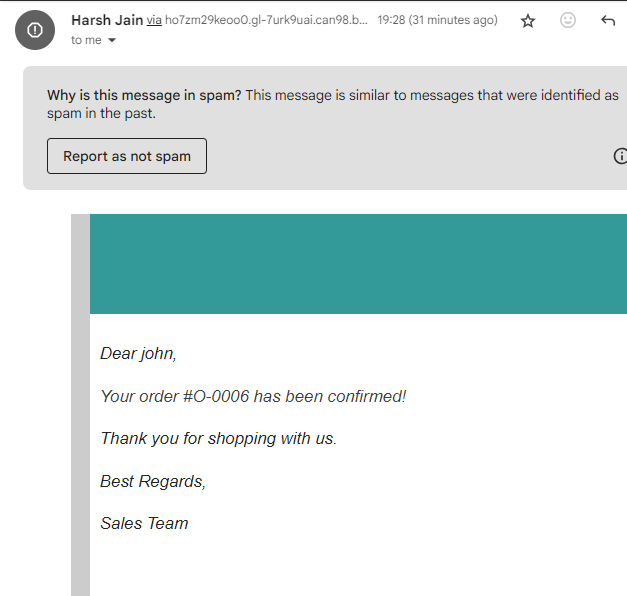
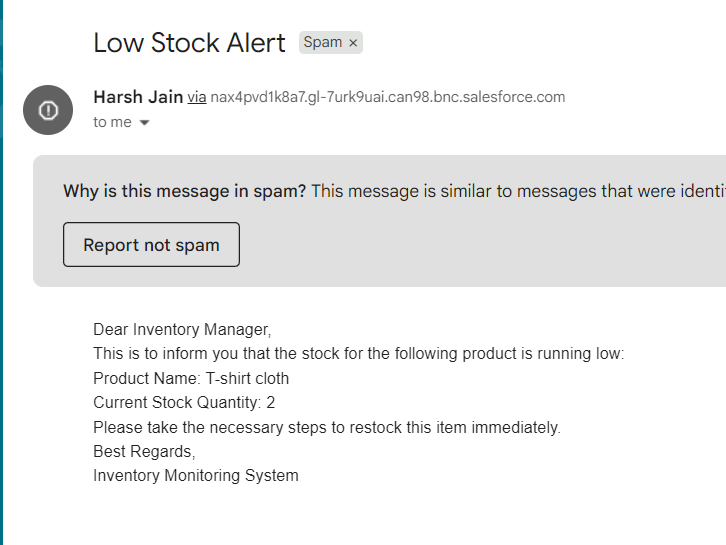
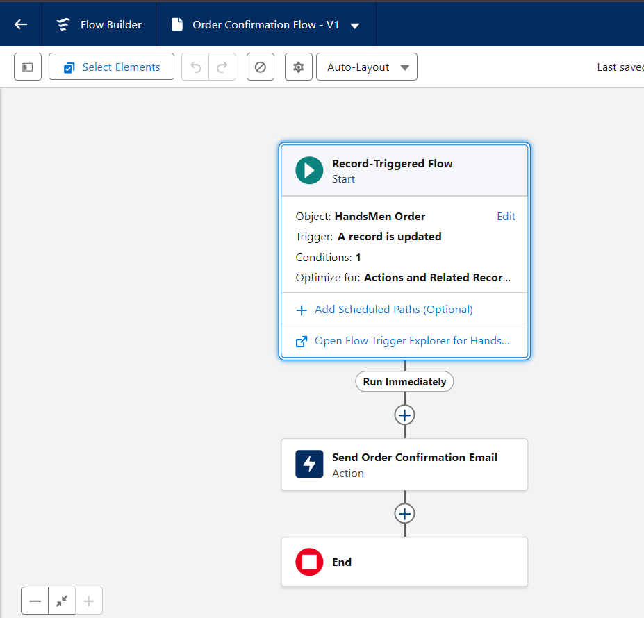
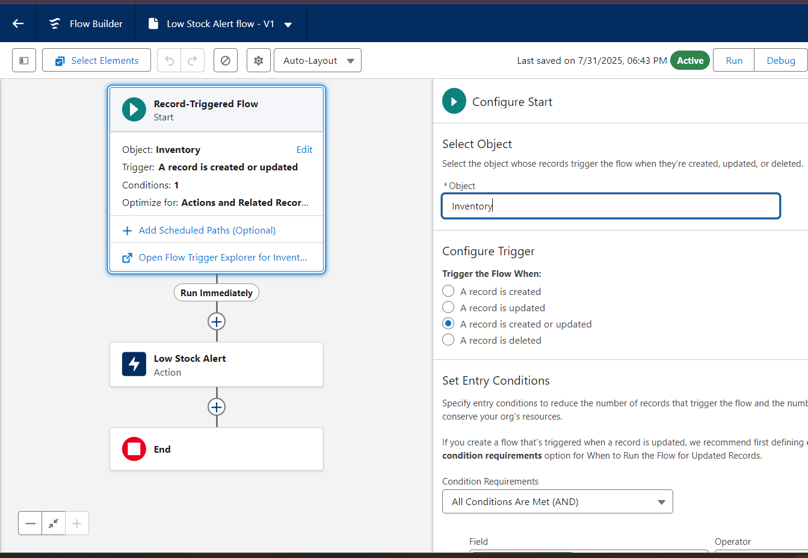
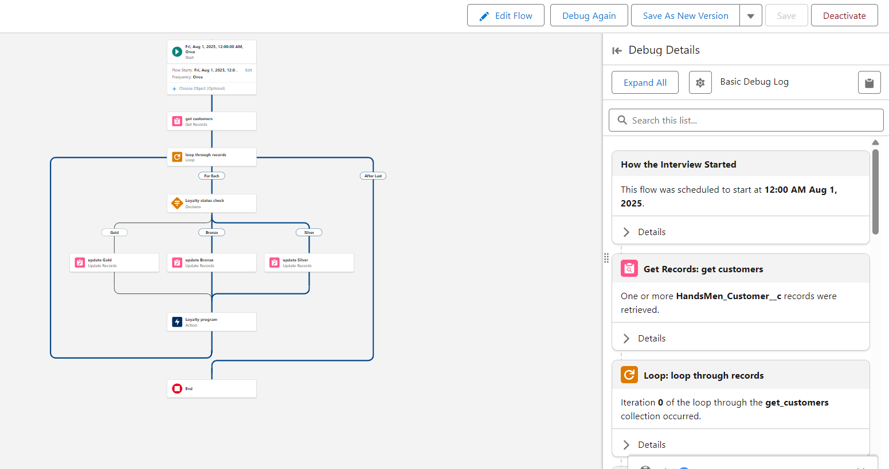

# HandsMen Threads – Salesforce-Powered Business Automation Suite

##  Overview

HandsMen Threads, a dynamic organization in the fashion industry, launched this Salesforce-powered solution to revolutionize data management and streamline customer interactions. The solution delivers a scalable, intelligent backend with efficient automation and a clean UI to support business growth, customer satisfaction, and inventory accuracy.

---

##  Key Features

- **Robust Data Modeling**: Designed to handle complex manufacturing, customer, and order records.
- **UI-Based Data Integrity**: Real-time validation ensures accurate and consistent information entry.
- **Email Automation**:
  - Order confirmations sent instantly post-purchase.
  - Stock alerts sent to warehouse when levels drop below 5.
- **Dynamic Loyalty Program**: Automatically updates loyalty status based on purchase history.
- **Scheduled Order Processing**: Daily midnight batch jobs update bulk orders, inventory, and financials.

---

## What You'll Learn

- Data Modeling in Salesforce
- Record-Triggered and Scheduled Flows
- Email Alerts and Templates
- Apex Triggers & Classes
- Batch Apex (Asynchronous Processing)
- Lightning App Builder
- Data Security (Profiles, Roles, Permission Sets)

---

## 🧩 Objects Overview

| Object Name         | Type      | Key Fields                             |
|---------------------|-----------|----------------------------------------|
| `Customer__c`       | Custom    | Name, Email, Loyalty Status            |
| `Order__c`          | Custom    | Order Date, Customer, Total Amount     |
| `Product__c`        | Custom    | Stock Level, Price, SKU                |
| `Warehouse__c`      | Custom    | Name, Location                         |
| `OrderLineItem__c`  | Junction  | Order ↔ Product, Quantity              |

---

## 📂 Flows & Automation

- ✅ **Order Confirmation Flow** (Record-triggered): Sends email to customer post-order.
- ⚠️ **Stock Alert Flow** (Scheduled Flow): Sends alert if stock < 5.
- 🔁 **Loyalty Update Trigger**: Apex trigger calculates loyalty status.
- 🕛 **Midnight Batch Job**: Apex Batch Class for bulk order processing.

---

## 💌 Email Templates

- **Order Confirmation Email**:
  - Dynamic merge fields: Customer Name, Order Total, Items
- **Stock Alert Email**:
  - Auto-sent to warehouse team for proactive inventory management

---

## 📸 Screenshots & Demonstrations

> Add visuals below to help your reviewers understand your project better.

### 🔷 Object Schema

| Object | Screenshot |
|--------|------------|
| Customer__c |  |
| Product__c |  |
| Order__c |  |

---

### 📤 Email Alert Examples

- **Order Confirmation**  
  

- **Low Stock Alert**  
  

---

### 🔄 Flow Diagrams

- **Order Confirmation Flow**  
  

- **Stock Alert Flow**  
  

- **Scheduled Bulk Processing**  
  

---

## 🛠️ Tools & Technologies

- Salesforce Lightning Experience
- Apex (Triggers, Batch)
- Flow Builder
- Email Templates
- GitHub for version control

---

## 📦 System Requirements

**Hardware**:
- Min 4 GB RAM (8 GB recommended)
- 10 GB free disk space

**Browser**:
- Chrome / Firefox / Edge (latest versions)

**Network**:
- 30 Mbps broadband
- Allow access to `.salesforce.com` domains

---

## 🔗 Project Links

- 🔍 **Demo**: [[demo Video link here](https://youtu.be/lAtjCncebI8)]
- 💻 **GitHub Repository**: [[This repository](https://github.com/Harshjain10020/HandsMan-Threads-Project)]

---

## 🙌 Credits

Project developed as part of the **Salesforce Developer Program**.

Mentor: _(Add mentor name if assigned)_

---

## 🧠 Author

**Harsh Jain**  
[LinkedIn](https://linkedin.com) • [GitHub](https://github.com/)

---

